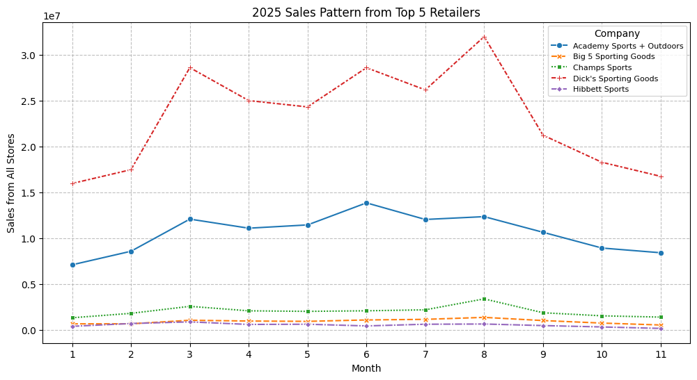
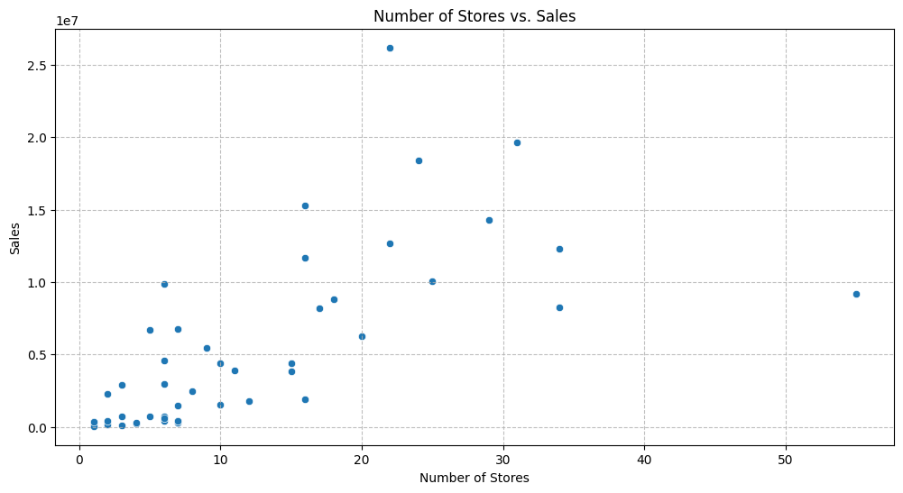
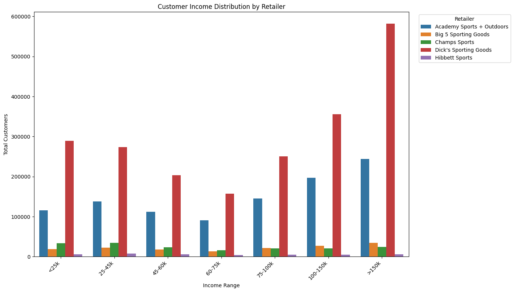
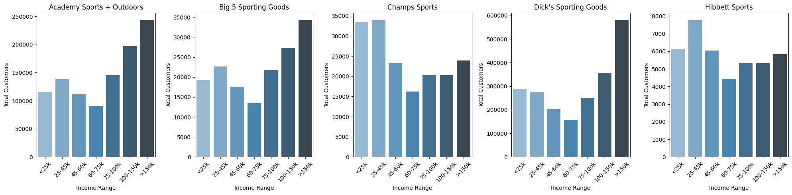
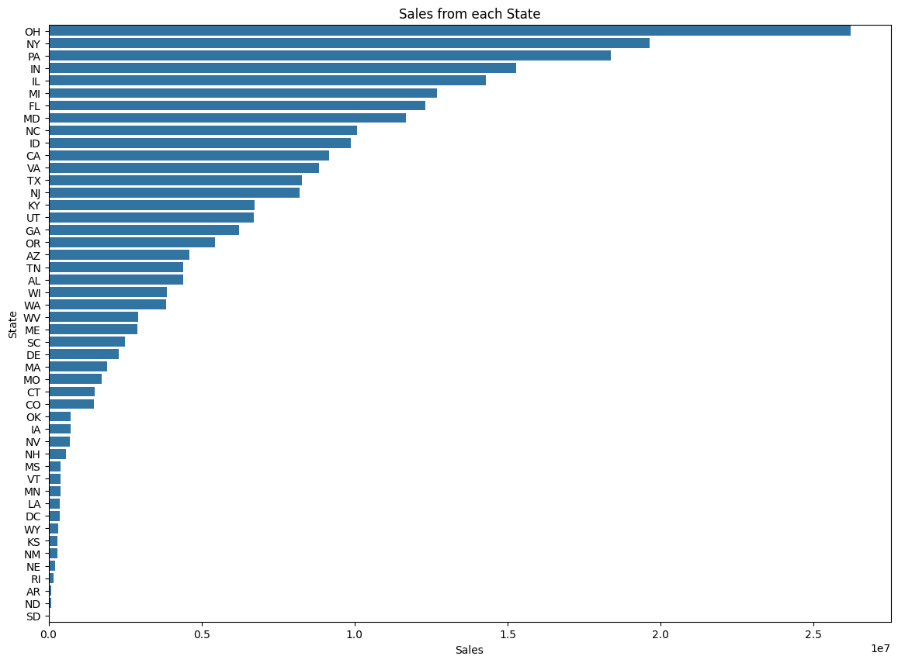
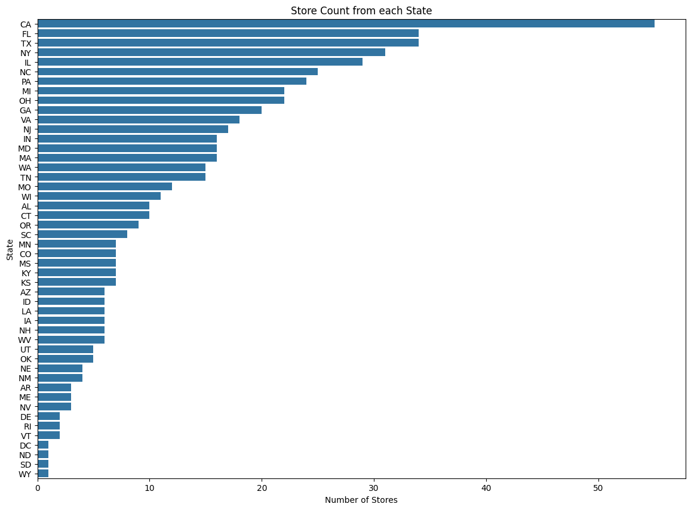

# U.S. Sporting Goods Retail Landscape

A data analysis project examining the competitive dynamics, sales patterns, and customer demographics of the U.S. sporting goods retail market using 2025 transaction data.

**Author:** Duy Nguyen | **Published:** January 2026

---

## Table of Contents

- [Project Overview](#project-overview)
- [Data Source](#data-source)
- [Tools and Methods](#tools-and-methods)
- [Key Findings](#key-findings)
- [Case Study: Dick's Sporting Goods](#case-study-dicks-sporting-goods)
- [Conclusion](#conclusion)
- [Recommendations](#recommendations)
- [Repository Structure](#repository-structure)

---

## Project Overview

The U.S. sporting goods market exceeded **$110 billion** in 2025, fueled by a post-pandemic cultural shift that has turned sports participation into a primary driver of social identity. From pickleball courts to marathon starting lines, physical activity has become mainstream — and retailers are racing to capture the demand.

This project analyzes spending patterns across the **top 5 sporting goods retailers by store count** to answer three guiding questions:

- What is the current market sales pattern?
- Who are the market leaders and why?
- What strategic decisions can capture growth opportunities?

**Retailers analyzed:** Hibbett Sports · Dick's Sporting Goods · Big 5 Sporting Goods · Champs Sports · Academy Sports + Outdoors

---

## Data Source

| Field | Details |
|---|---|
| **Dataset** | Spend Patterns — SafeGraph via Dewey Data |
| **Citation** | SafeGraph. (2022). *Spend Patterns* [Dataset]. Dewey Data. https://doi.org/10.82551/NSF5-R186 |
| **Coverage** | January – November 2025 (12 months, December unavailable at time of analysis) |
| **Scope** | Anonymized monthly credit and debit card transactions at Points of Interest (POI) |
| **Primary metric** | `RAW_TOTAL_SPEND` — total transaction spend per store per month |

**Data preparation steps:**
1. Filtered to `SUB_CATEGORY = "Sporting Goods Stores"` from a broader retail dataset
2. Selected top 5 retailers by store count (26,893 records)
3. Removed 2,391 duplicate records
4. Dropped irrelevant columns with high null rates (`PARENT_PLACEKEY`, `CUSTOMER_HOME_CITY`)
5. Imputed income-related nulls using same-store historical values
6. Removed stores with incomplete monthly data (1,260 locations dropped)
7. Removed two extreme outliers from Academy Sports (October–November data errors)

---

## Tools and Methods

| Category | Details |
|---|---|
| **Languages** | Python |
| **Environment** | Google Colab |
| **Libraries** | pandas, numpy, matplotlib, seaborn |
| **Techniques** | Exploratory Data Analysis (EDA), Interquartile Range (IQR) outlier detection, missing value imputation, demographic segmentation |

---

## Key Findings

### 1. The market is dominated by two players

Dick's Sporting Goods and Academy Sports + Outdoors collectively captured **over 80% of total sales** among the top 5 retailers during peak months. This dominance is especially striking for Academy, which operates the fewest stores of the group.



### 2. Spring and Summer are peak season

Sporting goods retail follows a **March – August high season** — the inverse of general apparel, which peaks during holiday months. Seasonality had the greatest impact on Dick's (wide product range) and Big 5, while Academy showed more consistent year-round revenue.

### 3. Store count does not predict revenue

A scatter plot of Dick's locations by state showed a **cone-shaped, not linear, pattern** between number of stores and total sales — confirming that physical presence alone is not a reliable driver of profitability.



### 4. Two distinct customer segments exist in the market

Income distribution analysis revealed a clear split:
- **Group 1 (Champs Sports, Hibbett Sports):** Higher customer counts in lower income ranges — targeting youth and budget-conscious shoppers
- **Group 2 (Dick's, Academy, Big 5):** Customer concentration in higher income ranges — serving experience-driven, premium buyers

The **$60–75k income bracket was the lowest-performing segment across all retailers**, suggesting this group is either underserved or shopping elsewhere (e.g., e-commerce).





---

## Case Study: Dick's Sporting Goods

Dick's Sporting Goods is the **undisputed market leader** with 789 locations and revenue more than **double** the closest competitor (Academy) in every month of 2025.

### Geographic Revenue Distribution

Ohio ranked #1 in total sales — ahead of New York and Pennsylvania, where the company was founded and headquartered. California, Florida, and Texas lead in store count but do not match in revenue.





**Insight:** The mismatch between store count rankings and sales rankings suggests that **territory quality outweighs territory saturation** — having more stores in a state does not guarantee more revenue from it.

### Premium Customer Positioning

Dick's shows a significantly higher share of **>$150k income customers** compared to any other retailer. This points to a deliberate premium strategy: upmarket product curation, omnichannel experience, and in-store services that attract high-spending, loyal customers — while still retaining broad appeal across income levels.

---

## Conclusion

The U.S. sporting goods retail market in 2025 is not a level playing field. Two conclusions emerge from the data:

1. **Store count alone does not determine profitability.** Factors like regional market dynamics, product mix, and operational efficiency play a greater role than raw physical presence.

2. **Dick's Sporting Goods has built a premium, omnichannel brand** that not only dominates high-income customer segments but also sustains broad cross-segment appeal — making it the benchmark for market leadership in this industry.

---

## Recommendations

**For managers:**
- Invest in the **middle-income segment ($60–75k)**, which is currently underserved across all retailers. Without engagement, this group will default to e-commerce permanently.
- Build a **differentiated value proposition** beyond product and price — customer service, loyalty programs, and seamless returns are high-value differentiators in a saturated market.

**For investors:**
- Prioritize **regional concentration over national spread**. A smaller, high-performing footprint in strategic markets outperforms a broad network of low-efficiency stores.

**For new market entrants:**
- Target the middle-income segment, launch in competitive but underpenetrated regions, and develop a compelling brand identity aligned with a specific customer lifestyle.

---

## Repository Structure

```
U.S.-Sporting-Goods-Retail-Landscape/
│
├── Code_Sporting_Goods.ipynb          # Full analysis: data cleaning, EDA, visualizations
├── sample_data.csv                    # Sample of the SafeGraph Spend Patterns dataset
├── U.S. Sporting Goods Retail Landscape - Report.pdf   # Full written report
├── images/                            # Chart exports from the notebook
│   ├── sales_pattern_top5.png
│   ├── dicks_sales_by_state.png
│   ├── dicks_store_count_by_state.png
│   ├── stores_vs_sales_scatter.png
│   ├── customer_income_distribution.png
│   └── income_distribution_subplots.png
└── README.md
```

---

*Data covers January – November 2025. Transaction data reflects credit/debit card purchases only and may underrepresent total market revenue. Full methodology and limitations are documented in the report PDF.*
